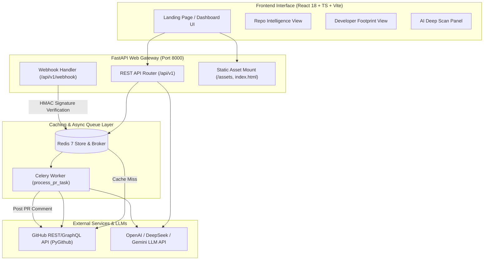

# CodeIntel: GitHub Repo Analyzer & AI Reviewer

> **An enterprise-grade, full-stack GitHub Repository Intelligence Platform and Automated AI Code Reviewer.**
> CodeIntel analyzes public GitHub repositories and developer profiles to generate deep-scan architectural insights, technical debt ratings, dynamic Mermaid charts, interactive file trees, smart previews, and automated AI pull request code reviews.

---

### Key Highlights

- **AI Deep Scan & Architecture Intelligence** — LLM-powered deep scans evaluating technical debt, security risk, trust calibration score, vibe check, key strengths/weaknesses, and developer personas.
- **Developer Footprint & Portfolio Profiling** — Comprehensive developer analysis featuring portfolio repository vibe scores, aggregated tech stack language breakdowns, activity commit charts, and AI-generated Developer Personas.
- **Automated AI Pull Request Reviewer** — Celery async worker & Redis webhook processor that fetches PR code diffs, evaluates quality & security alignment, and posts markdown review comments directly back to GitHub PRs.
- **Unified Full-Stack Architecture** — Single-command server deployment where FastAPI seamlessly serves both high-performance REST APIs and the built Vite + React 18 + TypeScript + Tailwind CSS production bundle.
- **Resilient Multi-Tier Caching & Graceful Fallback** — Redis caching with 1-hour TTL. Operates smoothly even if Redis or external LLM API keys are unavailable using intelligent mock/heuristic fallbacks.

---

## Architecture & System Data Flow



---

## Features in Detail

### 1. Repository Scanner & Codebase Analytics
- **Instant Metadata:** Real-time star counts, fork counts, watchers, primary topics, and descriptions.
- **Language Distribution:** Exact byte percentage breakdown visualized across primary languages.
- **Monthly Commit Timeline:** 6-month historical commit activity chart powered by Recharts.
- **Dynamic Architecture Diagram:** Auto-generated Mermaid.js workflow diagram mapping repository structure and tech stack components.
- **Recursive File Tree Explorer:** Interactive multi-level file and folder explorer built using recursive React components.
- **Complexity Score (1–10):** Calculated dynamically based on file volume and language diversity.
- **Key Features Auto-Extraction:** Auto-identifies indicators such as Docker containerization, CI/CD pipelines, documentation directories, automated test suites, build scripts, and env templates.

### 2. Smart Repository Preview System
- **Live Deployment Detection:** Inspects repository metadata for homepage/live URLs (e.g. GitHub Pages or custom domain) and provides a one-click launcher.
- **Markdown README Rendering:** If no live URL is configured, automatically fetches and renders the repository's `README.md` directly inside the dashboard preview panel.

### 3. AI Deep Scan (Architecture & Quality Inspection)
- **Technical Debt Rating:** Categorized as `Low`, `Medium`, or `High` based on project complexity, documentation presence, and file hierarchy.
- **Architecture Risk & Security Severity:** Evaluates structural risks and potential architectural anti-patterns.
- **Trust Calibration Score (0–100):** A metric reflecting documentation completeness, standard project layout, and repository hygiene.
- **Codebase Vibe Check:** A 2-3 sentence AI summary encapsulating the project's quality, design philosophy, and apparent goal.
- **Core Strengths & Weaknesses:** Explicitly highlights what the project handles exceptionally well and identifies the top architectural flaw or missing component.
- **DeepSeek R1 / Reasoning Model Support:** Built-in regex sanitizers automatically strip `<think>...</think>` tags and handle backtick-wrapped JSON output from modern reasoning models.

### 4. Developer Footprint & Portfolio Profiler
- **Global Profile Metrics:** Evaluates followers, following, public repository count, location, company, and total accumulated stars & forks across all projects.
- **Portfolio Vibe Scoring:** Analyzes top public projects and assigns a 0-100 "Vibe Score" based on star ratio, fork engagement, documentation presence, and repository flags.
- **Aggregated Language Distribution:** Calculates global language byte totals across all developer repositories.
- **AI Developer Persona Card:** Generates a structured profile featuring:
  - **Archetype:** e.g. *Full-Stack System Architect*, *Frontend UI Wizard*, *Data Science Explorer*.
  - **Vibe Check Summary:** Creative overview of the developer's GitHub presentation and coding style.
  - **Key Strengths & Growth Areas:** Tailored recommendations for career & repository growth.
  - **Contribution Style:** *Solo Builder*, *Open Source Contributor*, *Agile Hobbyist*, etc.

### 5. Automated AI Pull Request Reviewer
- **Webhook Gateway:** Listens to incoming GitHub Webhooks on `/api/v1/webhook`.
- **HMAC SHA256 Verification:** Verifies payload signatures using `GITHUB_WEBHOOK_SECRET` to ensure authenticity.
- **Asynchronous Processing:** Offloads heavy diff extraction and LLM calls to a background Celery worker queue powered by Redis.
- **PR Context Extraction:** Fetches full unified diffs, additions, deletions, modified file metadata, PR title, and description via GitHub API.
- **LLM Review Engine:** Evaluates code diffs for security vulnerabilities, logic bugs, code style violations, and requirement alignment.
- **PR Approval Confidence Score:** Calculates an automated score (0–100) and risk level (`Low`, `Medium`, `High`, `Critical`).
- **Automated GitHub Commenting:** Formats review output into markdown and posts it as an official comment on the Pull Request.

---

## Technology Stack

| Layer | Technology / Library | Purpose |
| :--- | :--- | :--- |
| **Frontend Framework** | React 18 + TypeScript 5 | UI rendering & strong typing |
| **Frontend Build Tool** | Vite 5 | Fast development HMR & optimized production bundling |
| **Styling & Components** | Tailwind CSS 3 + Radix UI | Modern dark-mode styling, glassmorphism & accessibility |
| **Data Visualizations** | Recharts | Responsive commit timelines & language breakdown charts |
| **Icons & Utilities** | Lucide React + Axios | Scalable UI icons & HTTP client |
| **Backend Framework** | FastAPI (Python 3.9+) | High-performance asynchronous REST API framework |
| **Data Validation** | Pydantic v2 + Pydantic Settings | Strict API request/response validation & env parsing |
| **GitHub Integration** | PyGithub 2.4.0 + Requests | Synchronous GitHub REST & GraphQL API wrappers |
| **Task Queue & Broker** | Celery 5.4.0 + Redis 7 | Asynchronous PR webhook task execution & messaging |
| **In-Memory Cache** | Redis 5.1.0 Client | 1-hour TTL result caching for repos & developer profiles |
| **AI / LLM Integration** | `openai` Python SDK (v1.0+) | OpenAI (gpt-4o) / DeepSeek / Gemini compatible integration |
| **Containerization** | Docker Compose | Isolated Redis container orchestration |

---

## Repository Structure

```text
analyzer/
├── main.py                   # FastAPI Application entry point & React static asset server
├── config.py                 # Pydantic BaseSettings environment configuration loader
├── database.py               # Centralized Redis connection manager with safe fallback
├── models.py                 # Pydantic v2 schemas for request validation & API responses
├── worker.py                 # Celery async task worker for background PR webhook reviews
├── requirements.txt          # Python backend dependencies
├── docker-compose.yml        # Docker Compose configuration for Redis 7
├── run.bat                   # Unified 1-click startup script (npm build + uvicorn launch)
├── profile_analysis_plan.md # Technical specification for Developer Profile Analysis
│
├── routes/                   # API Route Handlers
│   ├── api.py                # Core REST endpoints (/analyze, /deep, /profile, /profile/deep)
│   └── webhook.py            # GitHub PR Webhook router with HMAC SHA256 validation
│
├── analysis_engine/          # AI & Heuristic Intelligence Engine
│   ├── analysis_service.py   # Project type detection, complexity calculator, summary builder
│   ├── deep_scanner.py       # Prompt builders & parsers for Repo Deep Scans & Personas
│   ├── llm_reviewer.py       # LLM client abstraction layer (OpenAI/DeepSeek/Gemini)
│   └── metrics_calculator.py # PR approval confidence score & risk metrics calculation
│
├── github_integration/       # GitHub API Service Layer
│   └── github_service.py     # PyGithub wrappers for repos, commits, files, PR diffs & users
│
├── utils/                    # Shared System Utilities
│   └── cache_service.py      # Redis cache manager for 1-hour TTL payload storage
│
└── frontend/                 # React 18 + TypeScript + Vite Workspace
    ├── src/
    │   ├── components/       # DeepScanPanel, MetricsPanel, InsightsPanel, FileTree, etc.
    │   ├── layouts/          # DashboardLayout, ProfileDashboardLayout, RootLayout
    │   ├── pages/            # LandingPage (Search), AnalyzePage (Dashboard Router)
    │   ├── services/         # Axios API client & GitHub service helpers
    │   ├── hooks/            # Custom React hooks (useAnalyze, useAnalyzeProfile)
    │   ├── types/            # TypeScript definitions for API payloads
    │   └── utils/            # Helper utilities (GitHub URL parser, classnames)
    ├── package.json          # Node.js dependencies & scripts
    ├── tailwind.config.js    # Tailwind CSS custom theme & utilities configuration
    └── vite.config.ts        # Vite build tool configuration
```

---

## Getting Started

### Prerequisites

Ensure you have the following installed on your machine:
1. **Python 3.9 or higher** (`python --version`)
2. **Node.js v18 or higher** & **npm** (`node -v`)
3. **Docker Desktop** (Optional, required for Redis caching & Celery PR webhooks)

---

### 1. Environment Configuration

Create a `.env` file in the root directory of the project:

```env
# ── GitHub Authentication ──
GITHUB_TOKEN=your_github_personal_access_token_here
GITHUB_WEBHOOK_SECRET=your_webhook_secret_here

# ── Redis & Cache Configuration ──
REDIS_URL=redis://127.0.0.1:6379/0

# ── LLM / AI Configuration ──
LLM_PROVIDER=openai
LLM_API_KEY=your_openai_api_key_here
LLM_BASE_URL=https://api.openai.com/v1
LLM_MODEL=gpt-4o
```

> **Note:** If `GITHUB_TOKEN` is omitted, the app will make unauthenticated requests to GitHub (subject to lower rate limits: 60 req/hr vs 5,000 req/hr). If `LLM_API_KEY` is omitted, the app automatically falls back to heuristic & safe mock responses without crashing.

---

### 2. Start Redis Service (Optional - Recommended)

Start the Redis Docker container for caching and Celery task execution:

```bash
docker-compose up -d
```

---

### 3. Run the Unified Application Server

#### Option A: One-Click Startup Script (Windows)

Run the unified batch script. It automatically installs Node.js dependencies, builds the Vite production frontend into `frontend/dist`, installs Python packages, and launches Uvicorn:

```cmd
run.bat
```

#### Option B: Manual Startup (Cross-Platform)

1. **Build the Frontend:**
   ```bash
   cd frontend
   npm install
   npm run build
   cd ..
   ```

2. **Install Backend Dependencies:**
   ```bash
   pip install -r requirements.txt
   ```

3. **Start FastAPI Uvicorn Server:**
   ```bash
   python -m uvicorn main:app --port 8000 --reload
   ```

Once started, access the web application at:
- **`http://127.0.0.1:8000`**

Interactive Swagger API Documentation:
- **`http://127.0.0.1:8000/docs`**

---

### 4. Start the AI Celery Worker (Optional - For Automated PR Reviews)

To process GitHub Pull Request webhooks asynchronously and post automated AI code reviews, start the Celery worker in a separate terminal:

```bash
celery -A worker.celery_app worker --loglevel=info -P solo
```

> **Windows Note:** The `-P solo` execution pool flag is required on Windows operating systems for Celery task processing.

---

## REST API Documentation

### 1. Repository Analysis

#### `POST /api/v1/analyze`
Analyzes a public GitHub repository and returns structured metadata, language metrics, commits, and file tree.

- **Request Body:**
  ```json
  {
    "repo": "facebook/react"
  }
  ```

- **Response Envelope:**
  ```json
  {
    "success": true,
    "status": "complete",
    "data": {
      "project": {
        "name": "react",
        "owner": "facebook",
        "tech_stack": ["JavaScript", "HTML", "C++"],
        "project_type": "Web Application",
        "complexity_score": 8
      },
      "summary": "This project is a Web Application primarily built using JavaScript...",
      "key_features": ["Comprehensive documentation", "Open source licensing", "Automated testing suite"],
      "languages": [
        { "name": "JavaScript", "percentage": 85.4 },
        { "name": "HTML", "percentage": 10.2 }
      ],
      "commits": [
        { "month": "2024-03", "count": 142 }
      ],
      "file_tree": [],
      "architecture_diagram": "graph TD\n    A[\"Web Application\"] --> B[\"Source Code\"]...",
      "preview": {
        "type": "live",
        "url": "https://react.dev",
        "readme_content": null
      }
    },
    "error": null
  }
  ```

#### `GET /api/v1/analyze/deep?repo=owner/repo`
Triggers an AI Deep Scan for architectural quality, technical debt, and trust calibration.

- **Response Payload:**
  ```json
  {
    "success": true,
    "data": {
      "vibe_check": "A highly polished, modern frontend library with rigorous architecture and robust unit test coverage.",
      "technical_debt": "Low",
      "trust_score": 94,
      "security_severity": "Low",
      "key_strength": "Extremely thorough automated testing suite and clear module boundaries.",
      "key_weakness": "Complex build chain configuration."
    },
    "error": null
  }
  ```

---

### 2. Developer Profile Analysis

#### `POST /api/v1/analyze/profile`
Analyzes a GitHub developer profile, calculating portfolio vibe scores and aggregated language metrics.

- **Request Body:**
  ```json
  {
    "username": "gaearon"
  }
  ```

#### `GET /api/v1/analyze/profile/deep?username=gaearon`
Generates an AI-driven Developer Persona card evaluating coding archetype, strengths, and growth recommendations.

---

### 3. Webhooks & System Health

#### `POST /api/v1/webhook`
Receives GitHub `pull_request` webhooks (`opened`, `synchronize`, `reopened`). Validates HMAC `X-Hub-Signature-256` signatures and queues background Celery PR review tasks.

#### `GET /api/health`
Health check endpoint reporting server operational status and Redis cache memory usage/key counts.

---

## GitHub Webhook Integration Guide

To connect a GitHub Repository for automated AI PR reviews:

1. Navigate to your GitHub Repository -> **Settings** -> **Webhooks** -> **Add webhook**.
2. **Payload URL:** `https://your-domain.com/api/v1/webhook` (or use `ngrok http 8000` for local dev).
3. **Content type:** `application/json`
4. **Secret:** Set to the value defined in your `GITHUB_WEBHOOK_SECRET` environment variable.
5. **Which events would you like to trigger this webhook?** Select **Let me select individual events** and check **Pull requests**.
6. Ensure your Celery worker is running (`celery -A worker.celery_app worker --loglevel=info -P solo`).
7. Open a new PR in your repository—CodeIntel will analyze the diff and automatically post a code review comment!

---

## Robustness & Fallback Mechanisms

CodeIntel is engineered to be zero-downtime resilient:
- **Redis Down?** Automatically bypasses caching and fetches fresh data directly from GitHub without throwing exceptions.
- **No LLM API Key?** Automatically uses heuristic rule engines to provide clean, structured data payloads for deep scans and PR reviews.
- **GitHub Rate Limited?** Returns clear, human-friendly error envelopes while gracefully preserving previously cached results in Redis.

---

## Contributing

Contributions are welcome! Feel free to submit an issue or open a pull request.

1. Fork the repository
2. Create your feature branch (`git checkout -b feature/amazing-feature`)
3. Commit your changes (`git commit -m 'Add some amazing feature'`)
4. Push to the branch (`git push origin feature/amazing-feature`)
5. Open a Pull Request

---

## License

This project is open source and available under the **MIT License**.

---
*Created for college project & AI developer intelligence.*


